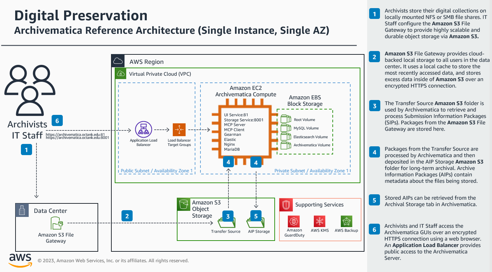

# Digital Preservation
## Archivematica on AWS

## Overview
Archivematica provides an integrated suite of free and open-source tools that allows users to process digital objects from ingest to archival storage and access in compliance with the ISO-OAIS functional model and other digital preservation standards and best practices. All of the Archivematica code and documentation is released under AGPL and Creative Commons open-source licenses.

The CloudFormation Templates in this repository deploy Archivematica 1.13.2 on a CentOS7 EC2 instance inside of a Well-Architected AWS environment. This repository also contains instructions on configuring backend S3 storage integration with Archivematica Spaces and Locations.

Institutions who would like to understand how AWS can help enable innovation and transformation or who have questions about this solution should [reach out to their AWS representatives](https://aws.amazon.com/government-education/contact/?trkCampaign=ps&trk=ps_blog_body). Please note that AWS does not provide Archivematica-related services or support.

## Security Disclaimer

- The sample code; software libraries; command line tools; proofs of concept; templates; or other related technology (including any of the foregoing that are provided by our personnel) is provided to you as AWS Content under the AWS Customer Agreement, or the relevant written agreement between you and AWS (whichever applies). You should not use this AWS Content in your production accounts, or on production or other critical data. You are responsible for testing, securing, and optimizing the AWS Content, such as sample code, as appropriate for production grade use based on your specific quality control practices and standards. Deploying AWS Content may incur AWS charges for creating or using AWS chargeable resources, such as running Amazon EC2 instances or using Amazon S3 storage.
- We highly recommend that production deployments include [HTTPS Listeners](https://docs.aws.amazon.com/elasticloadbalancing/latest/application/create-https-listener.html), [AWS Backup](https://docs.aws.amazon.com/aws-backup/latest/devguide/whatisbackup.html), [Amazon GuardDuty](https://docs.aws.amazon.com/guardduty/latest/ug/what-is-guardduty.html), [AWS Web Application Firewall](https://docs.aws.amazon.com/waf/latest/developerguide/waf-chapter.html), [AWS Systems Manager Patch Manager](https://docs.aws.amazon.com/systems-manager/latest/userguide/systems-manager-patch.html), and [User Authentication](https://www.archivematica.org/en/docs/archivematica-1.13/admin-manual/security/security/#authentication-security). 
- You must import into or generate a certificate with [AWS Certificate Manager](https://docs.aws.amazon.com/acm/latest/userguide/acm-overview.html) to install a HTTPS Listener on an Application Load Balancer. Use throw-away passwords for all users if HTTPS Listeners are not enabled on the Application Load Balancer.
- You should [change the password needed to authenticate to the MariaDB database](https://www.archivematica.org/en/docs/archivematica-1.13/admin-manual/security/security/).

## Reference Architecture



## Deployed Resources

- `1` S3 Bucket (S3 Standard + Bucket Policy)
- `1` KMS Key used for S3 Bucket and EBS Volume encryption
- `1` IGW + `2` NAT GW + `2` Public Subnets + `2` Private Subnets + `1` Private S3 VPC Endpoint + `2` Network Security Groups (Application Load Balancer + EC2 Instance)
- `1` Application Load Balancer + `2` Target Groups + `2` HTTP Listeners
- `1` IAM Role (Archivematica Server's access to S3 Bucket and Systems Manager)
- `1` EC2 Linux Instance - CentOS 7 on c6i.2xlarge - 8 vCPU/16 GB RAM (Archivematica Services)
- `4` EC2 EBS Volumes - Root Volume (10 GB GP3 SSD), MySQL Volume (10 GB GP3 SSD), Elasticsearch Volume (10 GB GP3 SSD), Archivematica Data Volume (500 GB GP3 SSD/16000 IOPS/125 Mbps Throughput)
    - NOTE: The Archivematica Data Volume must be 4x larger than the largest AIP that will be created. A 500 GB Data Volume will support the creation of 120 GB AIPs.

## Estimated Costs
You are responsible for the cost of the AWS services used while running this solution. As of `February 2023`, the monthly cost for running this in the US East (N. Virginia) Region with 25TB of Amazon S3 Standard and 100TB of Amazon S3 Glacier Instant Retrieval object storage is approximately $1,557.02 USD. Object storage costs will vary based on the total size of the collections being archived into Amazon S3. Amazon EC2 costs can be reduced by using a smaller instance size with less vCPU and less memory, and stopping the EC2 instance when its not in use. As additional AWS services and workloads are deployed, the cost will increase. 

| AWS Service      | Description | Cost per month |
| ---------------- | ----------- | ----------- |
| [Amazon Elastic Compute Cloud](https://docs.aws.amazon.com/AWSEC2/latest/UserGuide/concepts.html)  | Tenancy (Shared Instances), Operating system (Linux), Workload (Consistent, Number of instances: 1), Advance EC2 instance (c6i.2xlarge - 8 vCPU + 16 GB RAM), Pricing strategy (On-Demand), General Purpose SSD (gp3) - IOPS (16000), General Purpose SSD (gp3) - Throughput (1000 MBps), Storage amount (530 GB), Snapshot Frequency (Daily), Amount changed per snapshot (10 GB) | $426.70 USD |
| [Amazon Simple Storage Service](https://docs.aws.amazon.com/AmazonS3/latest/userguide/Welcome.html) | `25TB` [Amazon S3 Standard](https://aws.amazon.com/s3/storage-classes-infographic/) | $594.20 USD |
| [Amazon Simple Storage Service](https://docs.aws.amazon.com/AmazonS3/latest/userguide/Welcome.html) | `100TB` [Amazon S3 Glacier Instant Retrieval](https://aws.amazon.com/s3/storage-classes-infographic/) | $470.34 USD |
| [Amazon Virtual Private Cloud](https://docs.aws.amazon.com/vpc/latest/userguide/what-is-amazon-vpc.html) | `2` [NAT Gateway](https://docs.aws.amazon.com/vpc/latest/userguide/vpc-nat-gateway.html) | $65.78 USD |
| [Elastic Load Balancing](https://docs.aws.amazon.com/elasticloadbalancing/latest/userguide/what-is-load-balancing.html) | `1` [Application Load Balancer](https://docs.aws.amazon.com/elasticloadbalancing/latest/application/introduction.html) | $24.62 USD |
| **Total Monthly Cost** | | **$1,581.64 USD** | 

## Install Instructions

### Installation Procedure Time
Up to 90 minutes to complete the installation and configuration of Archivematica.
- ~5 minutes - CloudFormation Stack deployment time
- ~30-45 minutes - Archivematica automatic bootstrap process
- ~15 minutes - Archivematica Amazon S3 integration configuration

### Pre-Install 

1. Subscribe to the appropriate AWS-provided CentOS 7 Amazon Machine Image (AMI) for the AWS Region that Archivematica will be deployed in. This requires you to launch an EC2 instance with the required AMI. You should terminate the EC2 instance once you are subscribed to the CentOS7 AMI.
    - us-east-1 = ami-002070d43b0a4f171 
    - us-east-2 = ami-05a36e1502605b4aa     
    - us-west-2 = ami-08c191625cfb7ee61 

### Install via CloudFormation Template
1. Download the appropriate CloudFormation Template for your environment:
    - To deploy in an existing VPC: [archivematica-use-existing-vpc](/cloudformation/archivematica-use-existing-vpc.yaml)
    - To deploy a net-new VPC: [archivematica-create-new-vpc](/cloudformation/archivematica-create-new-vpc.yaml)
2. Log into your AWS Account and navigate to the CloudFormation Console.
3. Create and deploy a New Stack using the CloudFormation Template.
4. The CloudFormation Stack takes approximately 5 minutes to deploy the AWS infrastructure. It can take up to 40 minutes to fully bootstrap the EC2 instance with the Archivematica software. A /tmp/bootstrap_complete file will be created when the bootstrap is complete. You can proceed to the Archivematica Configuration section while the instance is being bootstrapped.

### Archivematica Configuration

Notes: 
- Replace all appearances of ***ALB-URL*** in the following steps with the DNS name of the Application Load Balancer. You can find the Application Load Balancer DNS name by checking the CloudFormation Stack's Outputs tab or through the EC2 service in the Load Balancers menu.

You can complete the following steps while the EC2 instance is still being bootstrapped:
1. In the AWS Console, go to the EC2 service, find the 500GB EBS Volume attached to the Archivematica EC2 instance, modify the EBS Volume properties, and change the Throughput value to 1000. This will increase disk read/write throughput to 1000MB/sec.
2. In the AWS Console, go to the S3 service, find the Archivematica S3 bucket, and create (2) folders inside of it: aip_storage and transfer_source.
3. In the AWS Console, go to the EC2 service, change Archivematica's Application Load Balancer's Security Group Ingress Rule to allow HTTP/HTTPS traffic from your restricted public IP address range.
4. In your browser, periodically check to see if the Archivematica Services are up by navigating to ***http://ALB-URL:81***. You can also check on the status of the bootstrap by monitoring the /tmp directory for files beginning with bootstrap*. ***Proceed to the next step when this URL presents the Archivematica configuration wizard.***
5. In the AWS Console, go to the EC2 service, select the Archivematica EC2 instance, click the Connect button, SSH into the Archivematica EC2 instance using Session Manager and run the following command. Session Manager does not require you to open SSH up to the internet and uses temporary SSH keys to grant console access. The following command will create a Super User for the Storage Service backend hosted on port 8001. You will use this Super User to log into the Storage Service and configure Storage Spaces and Locations.
```
sudo -u archivematica bash -c " \
    set -a -e -x
    source /etc/default/archivematica-storage-service || \
        source /etc/sysconfig/archivematica-storage-service \
            || (echo 'Environment file not found'; exit 1)
    cd /usr/lib/archivematica/storage-service
    /usr/share/archivematica/virtualenvs/archivematica-storage-service/bin/python manage.py createsuperuser
  ";
```
6. In your browser, complete the Archivematica installation wizard by navigating to the Archivematica Dashboard @ ***http://ALB-URL:81/***. Use ***http://ALB-URL:81/*** for for Public URL configuration option.
7. In your browser, Login to the Archivematica Storage Service by navigating to ***http://ALB-URL:8001/*** and using the username and password you created in Step #5. Navigate to the Administration -> Users menu and select the super-user you created in Step #5. Copy the API key from the user.
8. In your browser, Go back to the Archivematica Dashboard @ ***http://ALB-URL:81/*** and configure Storage Settings with the API Key and Storage Service super-user name. You can locate Storage Settings in Administration, under the General tab. This allows the Dashboard to send requests to the Storage Service for processing. You should also use ***http://localhost:8001/*** for the Storage Service URL.
9. In your browser, Login to the Archivematica Storage Service UI by navigating to ***http://ALB-URL:8001/*** and configure a Storage Space and AIP Storage/Transfer Source Locations. The AIP Storage and Transfer Source Locations should point to a specific S3 Bucket prefix (relative path).
    - ***Storage Space Configuration (Amazon S3)***
        - **Access Protocol**: S3
        - **Path**: /var/archivematica/sharedDirectory/s3/
        - **Staging Path**: /var/archivematica/sharedDirectory/s3/staging/
        - **Access Key ID**: Leave Blank
        - **Secret Access Key**: Leave Blank
        - **S3 Endpoint URL**: https://s3.amazonaws.com
        - **Region**: Use Current Region (e.g. us-west-2)
        - **S3 Bucket**: archivematica-111111111111-dev (change 111111111111 to your AWS Account ID)
    - ***Storage Location Configuration (AIP Storage) - This Location should be created under the Amazon S3 Storage Space.***
        - **Purpose**: AIP Storage
        - **Relative Path**: /aip_storage/ - This should point to the AIP Storage folder in the S3 Bucket.
        - **Description**: S3 AIP Storage
        - **Enabled**: True
        - **Set as global default location for its purpose**: True
    - ***Storage Location Configuration (Transfer Source) - This Location should be created under the Amazon S3 Storage Space.***
        - **Purpose**: Transfer Source
        - **Relative Path**: /transfer_source/ - This should point to the Transfer Source folder in the S3 Bucket.
        - **Description**: S3 Transfer Source
        - **Enabled**: True
        - **Set as global default location for its purpose**: True

## Cleaning Up

### Destroy Environment (CFT)
- Empty the S3 Bucket created by the CloudFormation Template.
- Delete the CloudFormation Stack from the AWS CloudFormation Console.

## Security
See [CONTRIBUTING.md](CONTRIBUTING.md) for more information.

## License
This library is licensed under the MIT-0 License. See the [LICENSE](LICENSE) file.

## References
- [Archivematica Documentation](https://www.archivematica.org/en/docs/archivematica-1.13/)
- [Amazon Simple Storage Service File Gateway Performance](https://docs.aws.amazon.com/filegateway/latest/files3/Performance.html)

## Third Party Packages Disclaimer
This package depends on and may incorporate or retrieve a number of third-party
software packages (such as open source packages) at install-time or build-time
or run-time ("External Dependencies"). The External Dependencies are subject to
license terms that you must accept in order to use this package. If you do not
accept all of the applicable license terms, you should not use this package. We
recommend that you consult your company’s open source approval policy before
proceeding.

Provided below is a list of External Dependencies and the applicable license
identification as indicated by the documentation associated with the External
Dependencies as of Amazon's most recent review.

THIS INFORMATION IS PROVIDED FOR CONVENIENCE ONLY. AMAZON DOES NOT PROMISE THAT
THE LIST OR THE APPLICABLE TERMS AND CONDITIONS ARE COMPLETE, ACCURATE, OR
UP-TO-DATE, AND AMAZON WILL HAVE NO LIABILITY FOR ANY INACCURACIES. YOU SHOULD
CONSULT THE DOWNLOAD SITES FOR THE EXTERNAL DEPENDENCIES FOR THE MOST COMPLETE
AND UP-TO-DATE LICENSING INFORMATION.

YOUR USE OF THE EXTERNAL DEPENDENCIES IS AT YOUR SOLE RISK. IN NO EVENT WILL
AMAZON BE LIABLE FOR ANY DAMAGES, INCLUDING WITHOUT LIMITATION ANY DIRECT,
INDIRECT, CONSEQUENTIAL, SPECIAL, INCIDENTAL, OR PUNITIVE DAMAGES (INCLUDING
FOR ANY LOSS OF GOODWILL, BUSINESS INTERRUPTION, LOST PROFITS OR DATA, OR
COMPUTER FAILURE OR MALFUNCTION) ARISING FROM OR RELATING TO THE EXTERNAL
DEPENDENCIES, HOWEVER CAUSED AND REGARDLESS OF THE THEORY OF LIABILITY, EVEN
IF AMAZON HAS BEEN ADVISED OF THE POSSIBILITY OF SUCH DAMAGES. THESE LIMITATIONS
AND DISCLAIMERS APPLY EXCEPT TO THE EXTENT PROHIBITED BY APPLICABLE LAW.

AGPL-3.0 archivematica https://packages.archivematica.org/1.13.x/centos
AGPL-3.0 archviematica-extras https://packages.archivematica.org/1.13.x/centos-extras